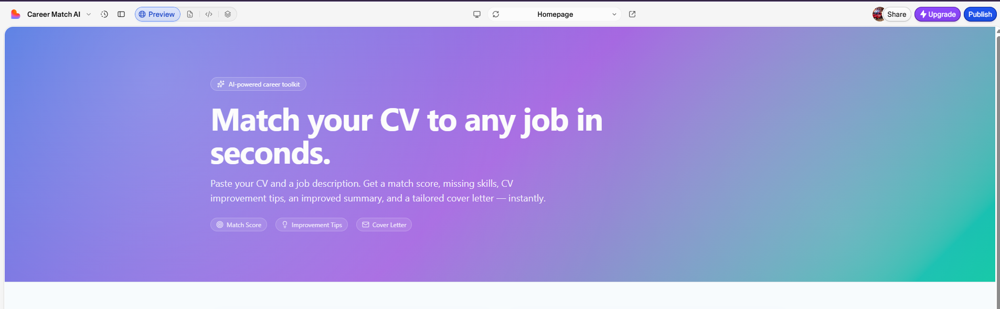
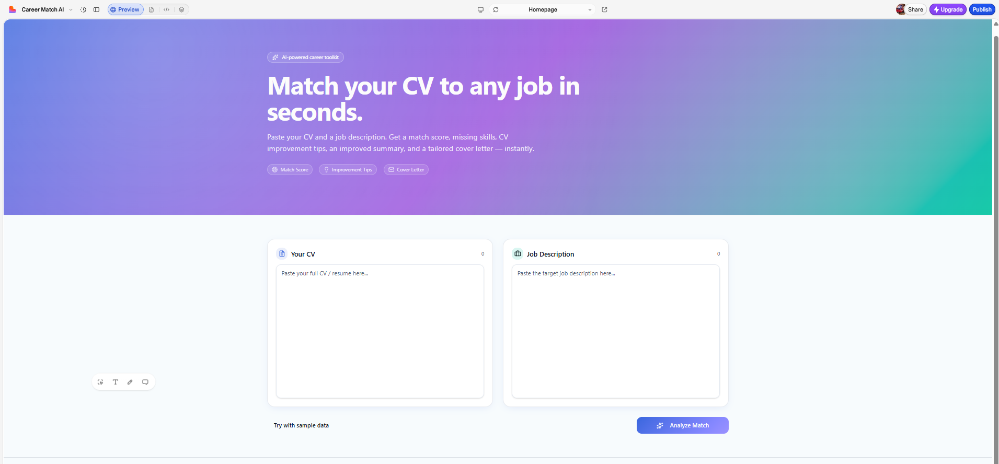
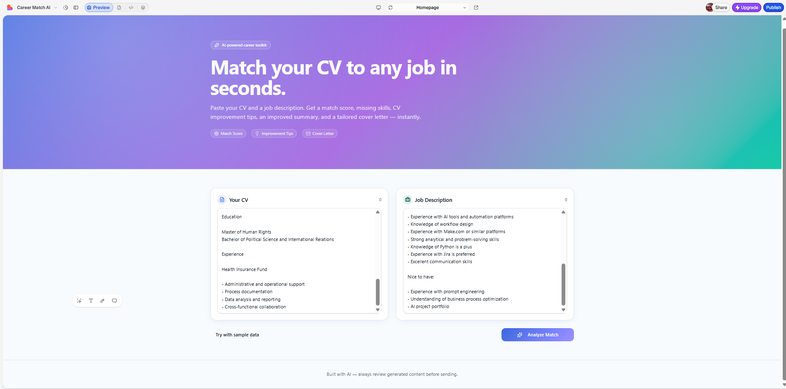

# AI CV & Cover Letter Generator

## Overview

AI-powered application that analyzes CVs, compares them with job descriptions, and generates tailored cover letters.

## Live Demo

Currently under development in Lovable. 

## Problem

Job seekers often struggle to adapt their CV and cover letter for each job application.

## Solution

This tool helps users improve their applications by analyzing the CV against a job description and generating personalized suggestions.

## Key Features

- CV analysis
- Job description matching
- Match score
- Missing skills detection
- Improved professional summary
- Tailored cover letter generation

## Technologies Used

- Base44
- AI Prompt Engineering
- Recruitment Workflows
- CV Analysis
- Job Matching

## Project Goal

Help job seekers create stronger, more targeted applications faster and increase their interview opportunities.

## Screenshots

### Homepage

### CV Input

### Match Analysis

## What I Learned

- How AI can support recruitment workflows
- How to structure CV and job description analysis
- How to generate personalized cover letters
- How to design user-focused AI tools

## Future Improvements

- PDF upload support
- LinkedIn profile analysis
- ATS score calculation
- Export to PDF
- Multi-language support
